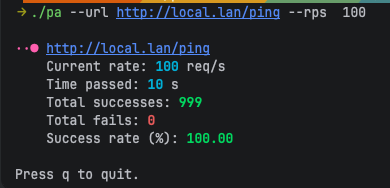

# Posh-attack

A simple HTTP load testing CLI tool with a real-time terminal user interface.

## Description

posh-attack is a command-line interface (CLI) tool written in Go that enables you to send a specified number of HTTP requests per second (RPS) to a given URL. The program displays key metrics in real time, including the current request rate, total successes, total failures, and the success rate percentage.

The application leverages the Bubble Tea library to create an aesthetically pleasing and interactive terminal interface.

## Preview

```
$ ./pa --url https://example.com --rps 100
```


## Features

- Sends a constant, user-defined number of requests per second (RPS).
- Terminal Interface with a loading spinner.
- Real-time, colored statistics:
  - Current requests per second (RPS)
  - Total successful requests (`2xx` status codes)
  - Total failed requests (network errors or `4xx`/`5xx` status codes)
  - Percentage of successful requests
- Simple to use with clear output.

## Installation

Ensure you have a Go environment installed (version 1.18 or newer).

1.  Clone the repository (or simply download the files).
    
2.  Navigate to the project directory and build the application:
    ```sh
    go build -o pa main.go
    ```
    This will create an executable file named `pa` in your current directory.

## Usage

Run the program by providing the two required flags: `--url` (only GET is supported) and `--rps`.

```sh
./pa --url <target-url> --rps <requests-per-second>
```

### Example

```sh
./pa --url https://api.example.com/v1/health --rps 50
```

To stop the program, press `q` or `Ctrl+C`.

## Dependencies

This project utilizes the fantastic libraries from [Charm](https://charm.sh/):
- [Bubble Tea](https://github.com/charmbracelet/bubbletea)
- [Lip Gloss](https://github.com/charmbracelet/lipgloss)
- [Bubbles](https://github.com/charmbracelet/bubbles)

The `go-arg` library from [alexflint](https://github.com/alexflint/go-arg) is used for command-line argument parsing.

## License

[MIT](LICENSE)